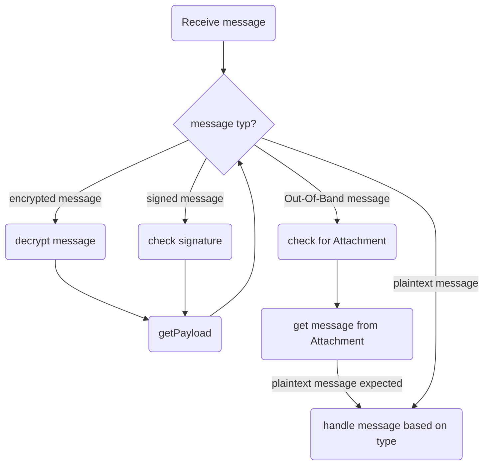
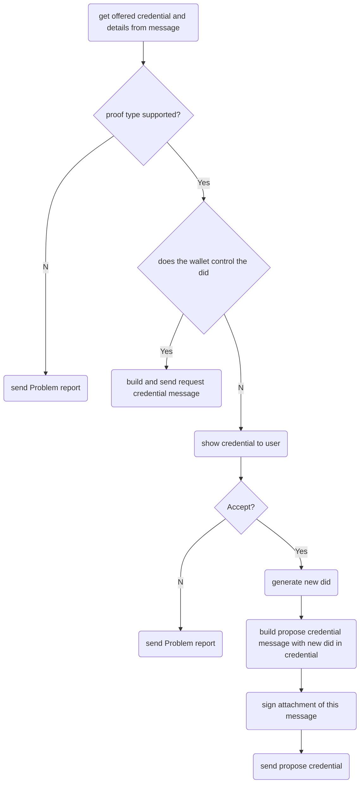
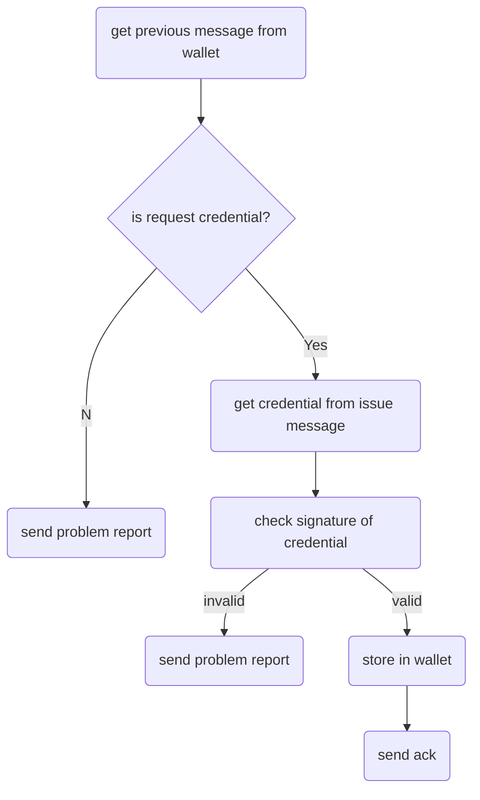
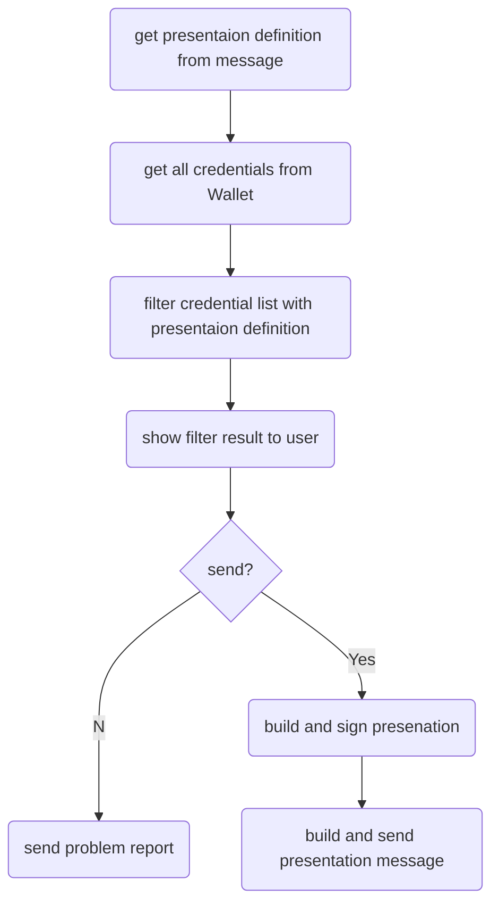

# Envelope handling
The wallet could receive Didcomm encrypted messages, didcomm signed messages and Out of Band messages.
These must be handled to find the relevant plaintext message in it.

**Note**: sending problem reports is not implemented yet; wallet will only throw exception

# Offer Credential

# Issue Credential

**Note**: sending problem reports is not implemented yet; wallet will only throw exception

# Request Presentation

