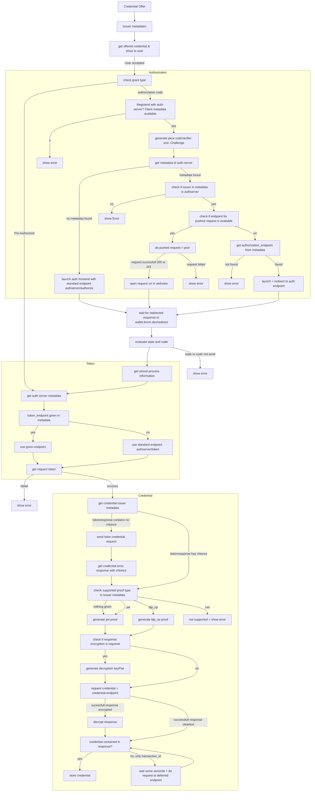

# Openid4VCI

## auth request parameter (redirect)

- response_type=code
- client_id
- redirect_uri
- state
- code_challenge
- code_challenge_method=S256

## pushed request parameter

- client_id
- redirect_uri
- response_type=code
- state
- code_challenge
- code_challenge_method=S256
- scope *or*
- authorization_details

## auth request parameter (redirect after pushed)

- client_id
- redirect_uri
- request_uri
- state
- response_type=code
- nonce=abcdefg
- scope (if given in offer)

## token request pre auth parameter

- grant_type
- pre-authorized_code
- user_pin (if required)

## token request auth flow parameter

- grant_type=authorization_code
- code
- client_id
- redirect_uri
- state
- code_verifier

## Credential Response Encryption

### Supported Alg values

- [x] RSA-OEAP-256
- [ ] ECDH-ES

### Supported Enc values

- [x] A128CBC-HS256
- [x] A192CBC-HS384 (since 3.2.3)
- [x] A256CBC-HS512 (since 3.2.3)
- [x] A128GCM (since 3.2.3)
- [x] A192GCM (since 3.2.3)
- [x] A256GCM (since 3.2.3)
